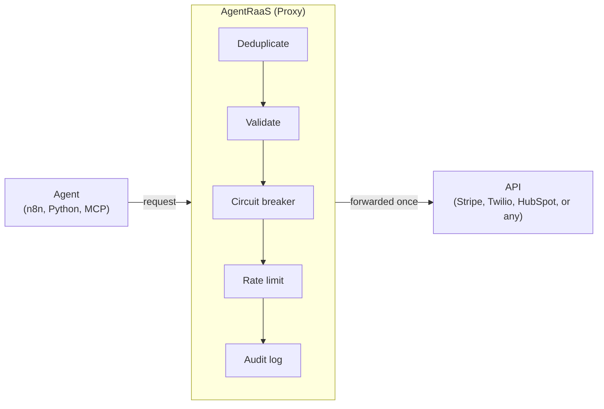

# AgentRaaS 🛡️

**The exactly-once execution layer for AI agents.**

Prevent your agents from double-charging customers, double-booking appointments, or sending duplicate emails. AgentRaaS sits between your agent and any API — connect it via webhook, SDK-style headers, or native MCP.

---

## The Problem

Your n8n workflow hits Stripe. It times out. n8n retries.

**Result:** The customer is charged twice.

Your agent calls HubSpot to create a contact. The request succeeds, but the response is lost. The agent retries.

**Result:** Two duplicate contacts in your CRM.

---

## The Solution

AgentRaaS is a proxy that guarantees **exactly-once execution** of agent actions — proven under real concurrent load with an automated test suite (`npm test`).



**How it works:**
1. Your agent sends a request to AgentRaaS instead of the API directly
2. AgentRaaS atomically claims a dedup slot in Redis for that exact request
3. **First call:** forwarded to the real API, result cached
4. **A concurrent or later retry:** returns the cached result, or a 409 if the original is still in flight — never a second real execution

---

## Dashboard

Open `http://localhost:13000/dashboard` — requires an account (register/login, encrypted password storage). New accounts get their own org automatically — nothing technical required just to see a working dashboard.

- **+ Connect Agent** — generates a real API key scoped to one org/agent, with curl and n8n examples
- **Credentials** — add your own Stripe/Twilio/etc. keys yourself, encrypted at rest, no server access needed
- **Custom Actions** — register any endpoint (not just the curated list below), SSRF-guarded, so your agents can call it too
- Total actions, success/deduplicated/blocked/error breakdown, request volume and outcome charts, over 24h/7d/30d/90d — scoped to your own data only, never other users'
- Active agents, service health (circuit breaker state), searchable/filterable/sortable recent activity log
- Auto-refreshing, CSV export, account settings (change password)
- A full step-by-step walkthrough lives at [`/guide`](./GETTING_STARTED.md) — worth reading if any of the above is unfamiliar

---

## Getting started

**Option 1 — clone this repo (fastest):**

```bash
git clone https://github.com/sumedhchatse/agentraas.git
cd agentraas
./install.sh
```

**Option 2 — from AgentRaaS Cloud:** register at **agentraas.io**, connect
your first agent, then download the self-host package from the
dashboard's Account menu (unlocks once you've connected an agent). Same
`install.sh`, just packaged with your Cloud account already wired up.

`install.sh` handles everything that used to be a manual multi-step
process: generating `JWT_SECRET` and `CREDENTIALS_ENCRYPTION_KEY`, starting
the stack, running every migration in order, installing dependencies
*inside* the container (native modules need to build for the container's
own OS, not your host's — this bit us hard during development, see below),
handling SELinux relabeling if applicable, and a clean recreate at the end.

Then open `http://localhost:13000/dashboard` and register a new account
— self-hosted instances are single-tenant, so whoever registers first is
just the first user, no special admin bootstrap needed. (Option 2's
account is pre-registered instead — use "Forgot password" to set a
password for this instance.)

**A real gotcha worth knowing, if you ever touch the setup manually:** on
SELinux (Fedora/RHEL-family hosts), bind-mounted files can end up with the
wrong context and the container fails with `EACCES` errors. `install.sh`
handles this automatically; if you're troubleshooting by hand, fix it with:
```bash
sudo semanage fcontext -a -t container_file_t "$(pwd)(/.*)?"
sudo restorecon -Rv "$(pwd)"
```
and from then on, always use `podman-compose down && up -d` (full recreate)
after changing files on the host — never plain `restart`, which doesn't
re-apply the SELinux label.

**Services:**
- API Gateway + dashboard: `http://localhost:13000`
- Postgres: `localhost:15432`
- Redis: `localhost:16379`

---

## Testing

```bash
podman exec -it ar-api npm test
```

Runs real integration tests against the running server — concurrent duplicate
requests, sequential replay, distinct-payload isolation, and failure/retry
recovery — not mocked unit tests. Uses the built-in `mockpay` service, so no
real API keys are needed to run them.

---

## Experimental: Rust rewrite of the API gateway

`src/api-gateway-rs` is a from-scratch Rust port of the same reliability
engine (Axum/Tokio/sqlx), built to be a drop-in replacement — it shares
this same Postgres/Redis, so you can run it side by side against
identical data. It's opt-in and off by default:

```bash
podman-compose --profile rust up -d ar-api-rs
curl http://localhost:13001/health
```

Not started by a bare `podman-compose up -d`. Treat it as experimental —
it isn't what a fresh `install.sh` gives you, and the Node service
(`ar-api`, port 13000) remains the default/primary path.

---

## MCP (Model Context Protocol)

AgentRaaS exposes an MCP gateway for Claude Desktop, Cursor, and other MCP clients:

```json
{
  "mcpServers": {
    "agentraas": {
      "command": "npx",
      "args": ["-y", "mcp-remote", "http://localhost:13000/mcp"]
    }
  }
}
```

All tool calls through this gateway are deduplicated, validated, rate-limited, and logged.

---

## Supported services

Curated, pre-configured integrations (no code required — see `config/services.json`):

Stripe, Twilio, HubSpot, Calendly, Shopify, Zoho, Razorpay, WhatsApp,
Zapier, Make, Adyen, Mollie, Airwallex, Xendit, PayPal, Salesforce, Slack,
Klarna, Paystack, GoCardless, Opn Payments, plus the built-in `mockpay`
for safe testing.

**Need something not on this list?** Register it as a **Custom Action** from
the dashboard — any URL, any auth type, protected by the same dedup/audit/
rate-limit pipeline, with an SSRF guard so it can't be pointed at internal
infrastructure.

To add a new *curated* integration permanently, add an entry to
`config/services.json` following the existing pattern — no code changes needed.

---

## Architecture


---

## Why AgentRaaS vs. DIY idempotency keys?

| | DIY Idempotency Keys | AgentRaaS |
|---|---|---|
| **Code changes** | Modify every API call | Change the URL |
| **No-code support** | ❌ Impossible | ✅ Paste webhook URL (n8n, Make, Zapier) |
| **Multiple services** | Different logic per API | One proxy, all services — plus any custom endpoint |
| **Credential management** | Build yourself | Self-serve, encrypted at rest |
| **Validation, circuit breaker, rate limiting** | Build yourself | Built-in |
| **Audit trail, dashboard** | Build yourself | Included |

---

## Pricing

Open-core, four tiers. Community is self-hosted only, with a limited
feature set — it's the free on-ramp. Pro, Agency, and Enterprise all run
either cloud-hosted (on AgentRaaS Cloud) or self-hosted, and unlock
everything above Community. The Pro/Agency/Enterprise-only pieces (SSO,
RBAC, inbound HMAC verification, PII/DLP redaction, distributed rate
limiting, tool output sanitization) live behind a separate commercial
license and simply aren't in this repo's source tree — see
[LICENSE.md](./LICENSE.md).

| | Community | Pro | Agency | Enterprise |
|---|---|---|---|---|
| **Price** | $0/mo | $20/mo | $100/mo | Custom, from $499/mo |
| **Deployment** | Self-hosted only | Cloud-hosted or self-hosted | Cloud-hosted or self-hosted | Cloud-hosted or self-hosted/on-prem |
| **Actions/month, self-hosted** | Unlimited | Unlimited | Unlimited | Unlimited |
| **Actions/month, cloud-hosted** | n/a (not offered) | 10,000 | 50,000 | Unlimited |
| **Team seats** | 1 | 3 | 10 | Unlimited |
| **Payload dedup, MCP gateway, dashboard** | ✅ | ✅ | ✅ | ✅ |
| **Human-in-the-Loop approval gateway (Slack)** | — | ✅ | ✅ | ✅ |
| **Audit log retention** | Local Postgres (30d) | Local Postgres (30d) | 1 year | SOC2-ready + SIEM export |
| **Client tenants / white-label** | — | — | ✅ up to 10 | ✅ unlimited |
| **Inbound webhook receivers** | — | — | ✅ | ✅ |
| **Outbound rate smoothing (token bucket)** | Static cap only | Static cap only | ✅ | ✅ |
| **Inbound HMAC verification, PII/DLP redaction** | — | — | — | ✅ |
| **SSO (OIDC/SAML), RBAC** | — | — | — | ✅ |
| **HA clustering** | — | — | — | ✅ |
| **Support** | GitHub & Discord | GitHub & Discord | Priority email | Priority, SLA-backed |

Community also has a free-to-try flavor on AgentRaaS Cloud (no install,
capped at 500 actions/month — the only tier/deployment combination with
any cap at all; self-hosting removes it entirely, on any tier). Get
started or self-host from `/dashboard`, or contact
**support@agentraas.io** for Agency/Enterprise sales.

---

## Roadmap

- [x] Exactly-once proxy engine — automated-test-verified under real concurrency
- [x] Validation rules, circuit breaker, rate limiting
- [x] Audit logging + real-time dashboard
- [x] MCP gateway
- [x] Self-serve encrypted credentials — real forwarding to Stripe/Twilio/etc. with your own keys
- [x] Custom Actions — call any endpoint, not just curated services
- [x] Dashboard auth (register/login, session management, change password)
- [x] Hosted AgentRaaS Cloud offering
- [x] Enterprise SSO (OIDC) + per-org RBAC — **Agency/Enterprise only, not in this repo**
- [x] Inbound webhook HMAC verification — 10+ providers — **Agency/Enterprise only, not in this repo**
- [x] PII/DLP redaction engine — **Agency/Enterprise only, not in this repo**
- [x] Distributed token-bucket rate limiter — **Agency/Enterprise only, not in this repo**
- [x] Tool Output Sanitization — redacts leaked PII and heuristic prompt-injection markers from a tool's response before your agent sees it — **Agency/Enterprise only, not in this repo**
- [x] Tamper-evident audit logs + SIEM export — **Agency/Enterprise only, not in this repo**
- [x] Agency tier — multi-tenant, white-label dashboard branding
- [x] Official Python SDK package (`src/sdk` — published to PyPI as `agentraas`)
- [x] Custom validation rule builder (UI) — per-org, per-service.action rules, including Custom Actions (which previously had no validation at all)
- [x] n8n/Flowise/Langflow integrations (`integrations/`) — n8n community node (compiles against real `n8n-workflow` types; full live-registration unverified, see `integrations/templates/README.md`), Flowise custom tool, Langflow custom component
- [x] "Pause & Buffer" maintenance mode — safely queues incoming webhooks during planned downtime or a downstream outage, auto-flushes on resume — **Agency/Enterprise only, not in this repo**
- [x] Multi-Destination Fan-Out (event broadcasting) — a Custom Action can broadcast the same payload to up to 5 extra `fanout_urls` as a best-effort copy, without affecting the primary response
- [x] Dynamic Header & Secret Injection — a Custom Action can set up to 10 custom outbound headers, each optionally encrypted at rest as a secret (e.g. a signing key)
- [x] Agent Run Budgeting & Loop Detection — an optional `X-AgentRaaS-Run-Id` header halts a tool call that's been repeated too many times with no state change, so a misbehaving agent stops itself instead of hammering a downstream API
- [x] State Checkpointing — an optional `X-AgentRaaS-Step-Id` (alongside Run-Id) replays a completed step's exact result instead of re-executing it, so a retried multi-step task resumes past what already succeeded
- [x] Semantic/entity-level idempotency keys — a dedup rule can set its own dedup window (instead of the 24h default) and normalize field values (trim/case-fold/numeric-coerce) so trivially different-looking duplicates still count as one
- [x] Experimental Rust rewrite of the API gateway (`src/api-gateway-rs`) — opt-in, same Postgres/Redis as the Node service, start it with `podman-compose --profile rust up -d ar-api-rs` (port 13001); not started by a bare `podman-compose up -d`
- [ ] Publish the JS SDK and n8n community node to npm
- [ ] Resolve n8n community-node live-registration issue and get it listed in the n8n community nodes directory
- [ ] CLI local tunneling / local dev relay (ngrok-style) — scoped but not started; this is a separate hosted relay service, not an addition to the existing proxy, see the discussion in this repo's history for what it'd need

---

## License

**One sentence:** everything in this repo is dual-licensed MIT/Apache-2.0
(genuinely open, no restrictions — [LICENSE-MIT](./LICENSE-MIT) /
[LICENSE-APACHE](./LICENSE-APACHE)). The Pro/Agency/Enterprise-only pieces
(SSO, RBAC, HMAC verification, DLP, distributed rate limiting, tool
output sanitization) aren't a flag or a config toggle — their source
simply isn't included in this repo at all, and lives under a separate
fair-code/source-available commercial license in the private edition
(`agentraas-enterprise`) — see [LICENSE.md](./LICENSE.md) for the exact
terms, including the metered free tier for AgentRaaS-hosted deployments
(500 actions/month) and the fact that self-hosting is unlimited on every
tier. Not an OSI-approved open-source license, modeled on n8n's
Sustainable Use License.

---

## Contributing & Security

See [CONTRIBUTING.md](./CONTRIBUTING.md) for the contribution process and
[CODE_OF_CONDUCT.md](./CODE_OF_CONDUCT.md) for community expectations.

**Found a security vulnerability?** Do not open a public issue — see
[SECURITY.md](./SECURITY.md) for the private disclosure process.

---

**Built with:** Fastify, Redis, PostgreSQL, Podman, and the fear of double-charging a customer at 2 AM.
