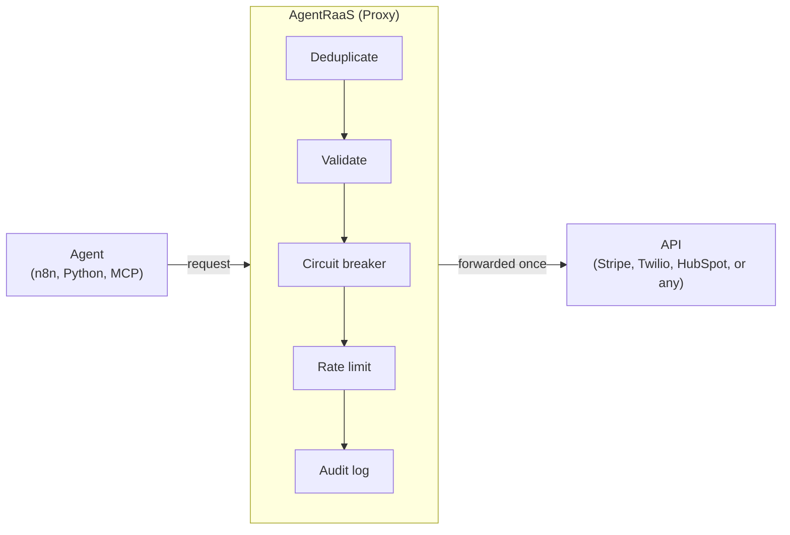
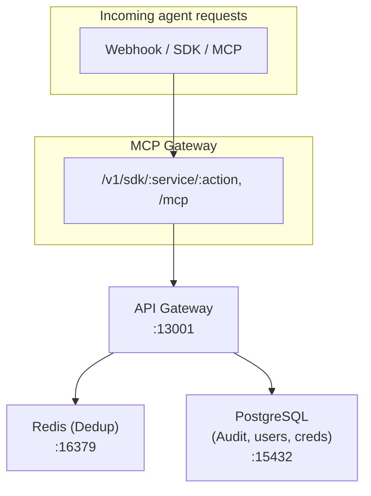

# AgentRaaS

**The agent reliability platform.**

AgentRaaS sits between your AI agents and every real-world action, giving you three things at once, not one trick: **reliability** (exactly-once execution, circuit breaking, proven under real concurrent load, not just claimed), **responsibility** (budget/loop limits and human-in-the-loop approval before the calls that matter), and **accountability** (a full audit trail and per-agent identity — scope-restricted credentials — for every action taken). Connect it via webhook, SDK-style headers, or native MCP. Self-hosted or cloud.

---

## The Problem

Your n8n workflow hits Stripe. It times out. n8n retries.

**Result:** The customer is charged twice.

Your agent calls HubSpot to create a contact. The request succeeds, but the response is lost. The agent retries.

**Result:** Two duplicate contacts in your CRM.

---

## The Solution

AgentRaaS is a proxy that guarantees **exactly-once execution** of agent actions — proven under real concurrent load with an automated test suite.



**How it works:**
1. Your agent sends a request to AgentRaaS instead of the API directly
2. AgentRaaS atomically claims a dedup slot in Redis for that exact request
3. **First call:** forwarded to the real API, result cached
4. **A concurrent or later retry:** returns the cached result, or a 409 if the original is still in flight — never a second real execution

---

## Dashboard

Open `http://localhost:13001/dashboard` — requires an account (register/login, encrypted password storage). New accounts get their own org automatically — nothing technical required just to see a working dashboard.

- **+ Connect Agent** — generates a real API key scoped to one org/agent, with curl and n8n examples
- **Credentials** — add your own Stripe/Twilio/etc. keys yourself, encrypted at rest, no server access needed
- **Custom Actions** — register any endpoint (not just the curated list below), SSRF-guarded, so your agents can call it too
- Total actions, success/deduplicated/blocked/error breakdown, request volume and outcome charts, over 24h/7d/30d/90d — scoped to your own data only, never other users'
- Active agents, service health (circuit breaker state), searchable/filterable/sortable recent activity log
- Auto-refreshing, CSV export, account settings (change password)
- A full step-by-step walkthrough lives at [`/guide`](./GETTING_STARTED.md) — worth reading if any of the above is unfamiliar

---

## Getting started

**Option 1 — clone this repo (fastest):**

```bash
git clone https://github.com/sumedhchatse/agentraas.git
cd agentraas
./install.sh
```

**Option 2 — from AgentRaaS Cloud:** register at **agentraas.io**, connect
your first agent, then download the self-host package from the
dashboard's Account menu (unlocks once you've connected an agent). Same
`install.sh`, just packaged with your Cloud account already wired up.

`install.sh` handles everything that used to be a manual multi-step
process: generating `JWT_SECRET` and `CREDENTIALS_ENCRYPTION_KEY`, building
the API image, starting the stack, running every migration in order,
handling SELinux relabeling if applicable, and a clean recreate at the end.
The first run compiles the Rust service from source — expect a few minutes
on that step; it isn't a hang.

Then open `http://localhost:13001/dashboard` and register a new account
— self-hosted instances are single-tenant, so whoever registers first is
just the first user, no special admin bootstrap needed. (Option 2's
account is pre-registered instead — use "Forgot password" to set a
password for this instance.)

**A real gotcha worth knowing, if you ever touch the setup manually:** on
SELinux (Fedora/RHEL-family hosts), bind-mounted files can end up with the
wrong context and the container fails with `EACCES` errors. `install.sh`
handles this automatically; if you're troubleshooting by hand, fix it with:
```bash
sudo semanage fcontext -a -t container_file_t "$(pwd)(/.*)?"
sudo restorecon -Rv "$(pwd)"
```
and from then on, always use `podman-compose down && up -d` (full recreate)
after changing files on the host — never plain `restart`, which doesn't
re-apply the SELinux label.

**Services:**
- API Gateway + dashboard: `http://localhost:13001`
- Postgres: `localhost:15432`
- Redis: `localhost:16379`

---

## Testing

```bash
cd src/api-gateway-rs
npm install                                            # one-time: axios/pg/ioredis
TEST_BASE_URL=http://localhost:13001 npm test
```

Runs real integration tests against the running server — concurrent duplicate
requests, sequential replay, distinct-payload isolation, and failure/retry
recovery — not mocked unit tests. Uses the built-in `mockpay` service, so no
real API keys are needed to run them. (These are plain Node HTTP-client tests
that live alongside the Rust service; the server itself has no Node in it.)

Plus a native Rust unit-test suite covering the dedup hashing, loop-detection,
and checkpoint logic directly — including golden-value tests that pin the
dedup hash format so it can't silently shift:

```bash
cd src/api-gateway-rs
cargo test --workspace                      # Community edition
cargo test --workspace --features enterprise
```

Both run on every push/PR via `.github/workflows/rust-test.yml`.

---

## MCP (Model Context Protocol)

AgentRaaS exposes an MCP gateway for Claude Desktop, Cursor, and other MCP clients:

```json
{
  "mcpServers": {
    "agentraas": {
      "command": "npx",
      "args": ["-y", "mcp-remote", "http://localhost:13001/mcp"]
    }
  }
}
```

All tool calls through this gateway are deduplicated, validated, rate-limited, and logged.

---

## Supported services

Curated, pre-configured integrations (no code required — see `config/services.json`):

Stripe, Twilio, HubSpot, Calendly, Shopify, Zoho, Razorpay, WhatsApp,
Zapier, Make, Adyen, Mollie, Airwallex, Xendit, PayPal, Salesforce, Slack,
Klarna, Paystack, GoCardless, Opn Payments, plus the built-in `mockpay`
for safe testing.

**Need something not on this list?** Register it as a **Custom Action** from
the dashboard — any URL, any auth type, protected by the same dedup/audit/
rate-limit pipeline, with an SSRF guard so it can't be pointed at internal
infrastructure.

To add a new *curated* integration permanently, add an entry to
`config/services.json` following the existing pattern — no code changes needed.

---

## Architecture



---

## Why AgentRaaS vs. DIY idempotency keys?

If you're only calling Stripe by hand from your own backend, its native
`Idempotency-Key` header is genuinely enough — you don't need this. The
honest case for AgentRaaS is narrower and specific:

- **Not every provider has native idempotency.** Stripe does. Twilio,
  Slack, most SaaS/CRM APIs, and literally any custom internal endpoint
  don't — you'd be building the same dedup logic yourself, per provider,
  by hand.
- **No-code tools can't set the header at all.** n8n, Make, and Zapier
  give you a URL field, not a place to compute and attach an idempotency
  key — so even Stripe's own native support is unreachable from a no-code
  workflow.
- **None of them give you one audit trail across services.** Stripe's
  idempotency keys only tell you what happened inside Stripe. An agent
  that calls Stripe, Twilio, and a custom CRM endpoint in the same run has
  zero unified record of which of those three actually fired, unless you
  build that yourself too.

| | DIY Idempotency Keys | AgentRaaS |
|---|---|---|
| **Code changes** | Modify every API call, only where the provider supports it | Change the URL |
| **No-code support** | ❌ Not possible — no-code tools can't set custom headers | ✅ Paste webhook URL (n8n, Make, Zapier) |
| **Providers without native idempotency** | Build your own dedup logic per provider | One proxy, same guarantee, every service |
| **Multiple services** | Different logic per API | One proxy, all services — plus any custom endpoint |
| **Credential management** | Build yourself | Self-serve, encrypted at rest |
| **Validation, circuit breaker, rate limiting** | Build yourself | Built-in |
| **Audit trail, dashboard** | Per-provider at best | One trail across every service you call |

---

## What happens when AgentRaaS is down?

**Fail-closed by design, not fail-silent.** AgentRaaS sits in the request
path between your agent and the real API. If it's unreachable, your call
to it fails — it does not silently succeed un-deduped. There is no
fallback path anywhere in the SDK, the n8n node, or the MCP gateway that
quietly calls Stripe or Twilio directly when AgentRaaS doesn't respond.
That's deliberate: routing around an outage would mean the exact
retry-storm double-charge scenario this product exists to prevent
happens silently, at the one moment you'd least want it to. Treat it
like any other proxy or database on your critical path — standard
timeout/retry handling on the calling side applies, same as it would for
any dependency.

**Latency:** we haven't published real p99 numbers yet. Self-hosted, it's
one network hop to a service running on your own infrastructure, not a
call out to us — but we're not putting an unmeasured number here. On the
roadmap, not fabricated.

---

## Pricing

Open-core, three tiers. Community is self-hosted only, with a limited
feature set — it's the free on-ramp. Team and Enterprise both run
either cloud-hosted (on AgentRaaS Cloud) or self-hosted, and unlock
everything above Community. The Enterprise module
(`src/api-gateway-rs/crates/api/src/ee/` — SSO, RBAC, HMAC, DLP, HA, SIEM
export) is source-available under a separate commercial license — see
[LICENSE.md](./LICENSE.md).

| | Community | Team | Enterprise |
|---|---|---|---|
| **Price** | $0/mo | $49/mo | Custom, from $499/mo |
| **Deployment** | Self-hosted only | Cloud-hosted or self-hosted | Cloud-hosted or self-hosted/on-prem |
| **Actions/month, self-hosted** | Unlimited | Unlimited | Unlimited |
| **Actions/month, cloud-hosted** | n/a (not offered) | 10,000 | Unlimited |
| **Team seats** | 1 | 3 | Unlimited |
| **Payload dedup, MCP gateway, dashboard** | ✅ | ✅ | ✅ |
| **Fuzzy/semantic similarity dedup** | — | ✅ | ✅ |
| **Human-in-the-Loop approval gateway (Slack + SLA auto-escalation)** | — | ✅ | ✅ |
| **Audit log** | Local Postgres, tamper-evident | Local Postgres, tamper-evident | + SIEM export |
| **Client tenants / white-label** | — | — | ✅ unlimited |
| **Inbound webhook receivers** | — | — | ✅ |
| **Inbound HMAC verification, PII/DLP redaction** | — | — | ✅ |
| **SSO (OIDC), RBAC** | — | — | ✅ |
| **Agent Identity / Agent Passport (scoped, short-lived agent tokens)** | — | — | ✅ |
| **HA clustering** | — | — | ✅ |
| **Support** | GitHub & Discord | GitHub & Discord | Priority, SLA-backed |

Community also has a free-to-try flavor on AgentRaaS Cloud (no install,
capped at 500 actions/month — the only tier/deployment combination with
any cap at all; self-hosting removes it entirely, on any tier). Get
started or self-host from `/dashboard`, or contact
**support@agentraas.io** for Enterprise sales.

---

## Roadmap

- [x] Exactly-once proxy engine — automated-test-verified under real concurrency
- [x] Validation rules, circuit breaker, rate limiting
- [x] Audit logging + real-time dashboard
- [x] MCP gateway
- [x] Self-serve encrypted credentials — real forwarding to Stripe/Twilio/etc. with your own keys
- [x] Custom Actions — call any endpoint, not just curated services
- [x] Dashboard auth (register/login, session management, change password)
- [x] Hosted AgentRaaS Cloud offering
- [x] Enterprise SSO (OIDC) + per-org RBAC (`crates/api/src/ee/sso.rs`)
- [x] Inbound webhook HMAC verification — 10+ providers (`crates/core/src/hmac_verify.rs`)
- [x] PII/DLP redaction engine (`crates/core/src/dlp.rs`)
- [x] Distributed token-bucket rate limiter (`crates/core/src/token_bucket.rs`)
- [x] Tamper-evident audit logs + SIEM export
- [x] Enterprise — multi-tenant, white-label dashboard branding
- [x] Official Python SDK package (`src/sdk` — published to PyPI as `agentraas`)
- [x] Custom validation rule builder (UI) — per-org, per-service.action rules, including Custom Actions (which previously had no validation at all)
- [x] n8n/Flowise/Langflow integrations (`integrations/`) — n8n community node (compiles against real `n8n-workflow` types; full live-registration unverified, see `integrations/templates/README.md`), Flowise custom tool, Langflow custom component
- [x] "Pause & Buffer" maintenance mode (Enterprise) — safely queues incoming webhooks during planned downtime or a downstream outage, auto-flushes on resume
- [x] Multi-Destination Fan-Out (event broadcasting) — a Custom Action can broadcast the same payload to up to 5 extra `fanout_urls` as a best-effort copy, without affecting the primary response
- [x] Dynamic Header & Secret Injection — a Custom Action can set up to 10 custom outbound headers, each optionally encrypted at rest as a secret (e.g. a signing key)
- [x] Agent Run Budgeting & Loop Detection — an optional `X-AgentRaaS-Run-Id` header halts a tool call repeated too many times with no state change
- [x] State Checkpointing — an optional `X-AgentRaaS-Step-Id` (with Run-Id) replays a completed step's result instead of re-executing it, so a retried multi-step task resumes past what already succeeded
- [x] Semantic/entity-level idempotency keys — a dedup rule can set its own dedup window and normalize field values so trivially different-looking duplicates still count as one
- [x] Tool Output Sanitization (Enterprise) — redacts leaked PII and heuristic prompt-injection markers from a tool's response before your agent sees it (`src/api-gateway-rs/crates/api/src/ee/output_sanitization.rs`)
- [x] Rust rewrite of the API gateway (`src/api-gateway-rs`) — Axum/Tokio/sqlx, feature-complete port of every Node route including Enterprise, now serving `agentraas.io` live (opt-in via `ENTERPRISE_MODE`/`--features enterprise` for the Enterprise build)
- [x] Tool Result & Context Pruner (Community + Enterprise) — auto-strips a raw tool response down before it reaches the model, opt-in per org (`crates/core/src/pruner.rs`)
- [x] Stateful Human-in-the-Loop Gateway (Enterprise) — freezes a matching action, posts an interactive Slack approval card, resumes on approval/denial, with SLA-based auto-escalation (`crates/api/src/ee/hitl.rs`)
- [x] Fuzzy/semantic similarity dedup (Team+) — catches near-duplicate payloads a strict hash-match would miss, on top of the existing per-field dedup rules
- [x] Agent Identity & Agent Passport (Enterprise) — short-lived, scope-restricted tokens (`art_live_...`) for an already-connected agent, checked at request time before any action is forwarded; minting one returns both the identity and the reliability guarantees (dedup mode, rate limit) already applied to it (`crates/api/src/ee/identity.rs`)
- [ ] Publish the JS SDK and n8n community node to npm — blocked on npm 2FA
- [ ] Resolve n8n community-node live-registration issue and get it listed in the n8n community nodes directory
- [ ] CLI local tunneling / local dev relay (ngrok-style) — scoped but not started; this is a separate hosted relay service, not an addition to the existing proxy, see the discussion in this repo's history for what it'd need

---

## License

**One sentence:** everything in this repo is dual-licensed MIT/Apache-2.0
(genuinely open, no restrictions — [LICENSE-MIT](./LICENSE-MIT) /
[LICENSE-APACHE](./LICENSE-APACHE)) *except* the enterprise module
(`src/api-gateway-rs/crates/api/src/ee/`,
`src/api-gateway-rs/crates/core/src/{dlp,hmac_verify}.rs`,
`compose.ee.yaml`), which is under a separate fair-code/source-available
commercial license — see [LICENSE.md](./LICENSE.md).

The enterprise module (SSO, RBAC, HMAC verification, DLP, distributed rate
limiting, HA) implements Team/Enterprise-tier features, required for
production use beyond a trial — see the Pricing section above or contact
**support@agentraas.io**. It's source-available in this repo (you can read
it, same as the core), just not freely redistributable/rebrandable —
[LICENSE.md](./LICENSE.md) has the exact terms, including the metered
free tier for AgentRaaS-hosted deployments (500 actions/month) and the
fact that self-hosting is unlimited on every tier. (This repo also keeps
`RESTRUCTURE_PLAN.md` around as internal planning notes on that split —
not required reading, just there if useful.)

---

## Contributing & Security

See [CONTRIBUTING.md](./CONTRIBUTING.md) for the contribution process and
[CODE_OF_CONDUCT.md](./CODE_OF_CONDUCT.md) for community expectations.

**Found a security vulnerability?** Do not open a public issue — see
[SECURITY.md](./SECURITY.md) for the private disclosure process.

---

**Built with:** Rust (Axum/Tokio/sqlx), Redis, PostgreSQL, Podman, and the fear of double-charging a customer at 2 AM.
