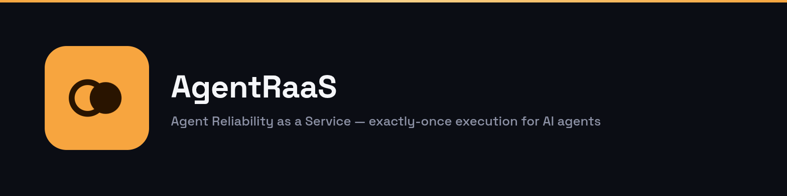
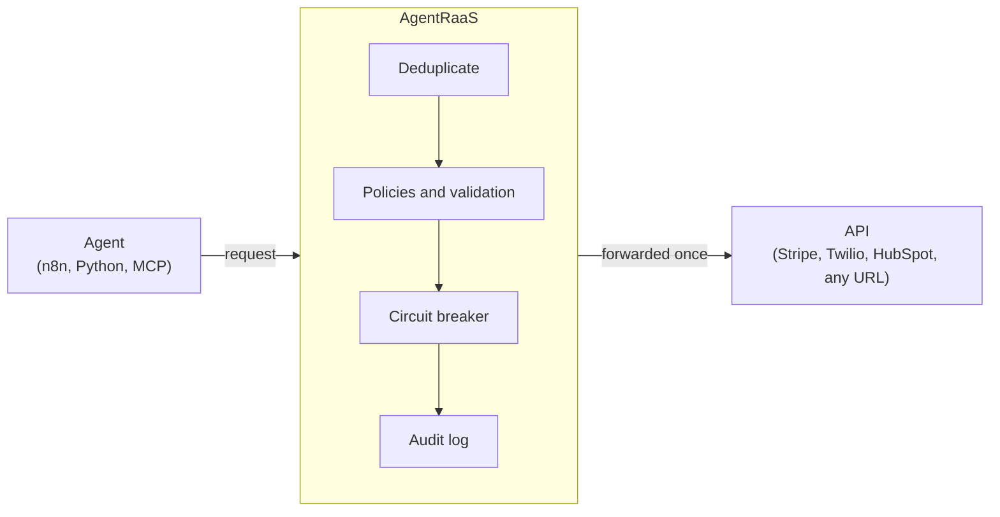

# AgentRaaS

**The reliability layer for what AI agents do.**

AgentRaaS sits between your agents and the APIs they act on. Every call runs
once even when it is retried, is checked against what that agent may do,
waits for a human when it is risky, and is recorded. Connect by webhook URL,
SDK headers or MCP. Free to self-host with every feature.

## The problem

Your n8n workflow calls Stripe. It times out, n8n retries, and the customer
is charged twice. Your agent creates a HubSpot contact, the response is
lost, the agent retries, and now there are two.

## How it works


```mermaid
flowchart LR
    Agent["Agent<br/>(n8n, Python, MCP)"] -->|request| P
    subgraph P["AgentRaaS"]
        direction TB
        D["Deduplicate"] --> V["Policies and validation"] --> C["Circuit breaker"] --> A["Audit log"]
    end
    P -->|forwarded once| API["API<br/>(Stripe, Twilio, HubSpot, any URL)"]
```

1. Your agent calls AgentRaaS instead of the API.
2. AgentRaaS claims a dedup slot in Redis for that exact request.
3. The first call is forwarded and its result stored.
4. A retry gets the stored result, or `409` while the first is still in flight.

A call that times out after it was sent is treated as **outcome unknown**:
never retried, its slot kept, sent to the dead-letter queue. Every forwarded
call also carries `Idempotency-Key: agentraas-<hash>`, so providers that honor
it (Stripe and others) run it once even on a replay.

## Free tools, no server needed

`pip install agentraas` runs entirely on your machine.

```bash
agentraas chaos --mock -- python my_agent.py   # find calls that would run twice
```

```python
from agentraas.local import exactly_once

@exactly_once()
def charge(customer, amount, idempotency_key=None):
    return stripe.Charge.create(customer=customer, amount=amount, idempotency_key=idempotency_key).id
```

- `protect_tool` for LangChain/LangGraph and CrewAI, `protectTools` for the
  Vercel AI SDK (`npm install agentraas`).
- `agentraas wrap -- <mcp server>` gives any MCP server exactly-once write
  tools and a log. In the [official MCP Registry](https://registry.modelcontextprotocol.io/v0/servers?search=io.github.sumedhchatse/agentraas).
- The chaos tester exits non-zero, so it can fail CI ([GitHub Action](src/chaos-action/action.yml)).

Details: [`src/sdk/README.md`](src/sdk/README.md), [`src/sdk-js`](src/sdk-js).

## Self-host

```bash
git clone https://github.com/sumedhchatse/agentraas.git
cd agentraas
./install.sh
```

`install.sh` generates the secrets, builds the image (the first Rust build
takes a few minutes), starts Postgres, Redis and MinIO, and runs the
migrations. Then open `http://localhost:13001/dashboard` and register.
Kubernetes: a Helm chart is in `infra/helm/`. Render: [one-click deploy](https://render.com/deploy?repo=https://github.com/sumedhchatse/agentraas).

On SELinux hosts, `install.sh` relabels the bind mounts. After changing files
by hand, recreate (`podman-compose down && up -d`) rather than `restart`.

## What you get

- **Runs once:** dedup across retries and machines, near-duplicate matching,
  step checkpoints, a cross-agent resource lock.
- **Policies:** what each agent may call and where it may send data,
  validation rules, spend and loop limits.
- **Human approval:** risky calls wait for approve or deny in Slack, with
  escalation.
- **Resilience:** circuit breaker, rate limits, dead-letter queue with replay.
- **Undo:** an action that ran can be reversed from the dashboard for 30 days
  (Stripe charge refunded, Slack message deleted, or your own reverse action),
  exactly once.
- **Audit and identity:** tamper-evident log, SIEM export, OpenTelemetry and
  Prometheus, short-lived scoped agent tokens.
- **Data safety:** PII redaction, prompt-injection filtering on tool output,
  schema drift alerts.
- **Teams:** OIDC SSO, roles, client tenants with white-label branding.

Curated services (Stripe, Twilio, HubSpot, Shopify, Slack, PayPal and more in
`config/services.json`), or register any URL as a Custom Action, SSRF-guarded.

## Why not just idempotency keys?

If you only call Stripe from your own code, its `Idempotency-Key` is enough.
AgentRaaS is for the rest: providers without one (most SaaS APIs and every
internal endpoint), no-code tools that can't set headers (n8n, Make, Zapier),
and one audit trail across every service an agent touches.

## When AgentRaaS is down

It fails closed. Nothing in the SDKs, the n8n node or the MCP gateway falls
back to calling the API directly, because that is exactly the unguarded retry
this product exists to stop. Treat it like a database on your critical path.

**Latency:** 2.1 to 2.4 ms added at the median, 2.9 to 3.7 ms at p95, measured
on one machine (Intel Core i3-12100, local stack, three runs of 500 calls) with
`infra/scripts/bench-overhead.py`. A retried duplicate is answered from cache.

## Pricing

Open source and free to self-host, with every feature, for any use inside
your company, no action limit. AgentRaaS Cloud at agentraas.io runs it for
you, pay as you go: every feature, the first 500 actions each month free,
then $1 per 1,000 actions that run (duplicates, blocked calls and approval
waits are never billed), up to a monthly cap you set. Paid usage opens soon;
until then Cloud accounts get the free 500 a month. No plans or tiers.

## Testing

```bash
cd src/api-gateway-rs
cargo test --workspace --features enterprise          # unit tests
TEST_BASE_URL=http://localhost:13001 npm test         # integration tests, real server
```

The integration tests send concurrent duplicates, replays and failures
through the built-in `mockpay` service, so no real API keys are needed.

## Next

- An undo log for agent actions, then record and replay.
- The n8n node in n8n's community directory (in review).

## Docs and license

[agentraas.io/docs](https://agentraas.io/docs) has the API, the
[troubleshooting guide](https://agentraas.io/docs#troubleshooting) and
self-hosting details.

The server is AGPL-3.0; its advanced features (SSO, approvals, DLP:
`crates/api/src/ee/`, `crates/core/src/{dlp,hmac_verify}.rs`,
`compose.ee.yaml`) are under the
Functional Source License, free for any use except a competing hosted service
and Apache-2.0 two years after each release. The SDKs are MIT/Apache-2.0.
See [LICENSE.md](./LICENSE.md).

[CONTRIBUTING.md](./CONTRIBUTING.md) · [SECURITY.md](./SECURITY.md) (report
vulnerabilities privately, not as issues) · [CODE_OF_CONDUCT.md](./CODE_OF_CONDUCT.md)

Built with Rust (Axum, Tokio, sqlx), Postgres and Redis.
